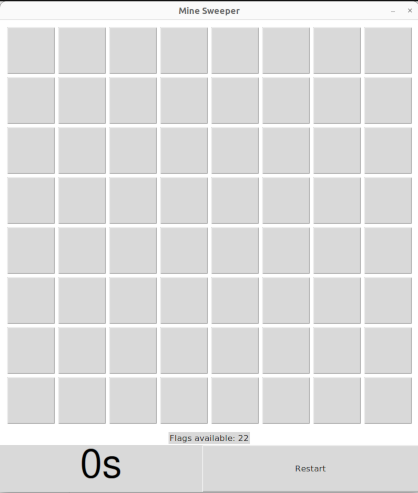

# tk-Minesweeper
- created the famous Minesweeper game as a CS50P final project.
- Entire gui is made using Tkinter.
### table of contents
- [How to Install](#how-to-install)
- [Usage](#usage)

## How to Install
1. Navigate to the main page of the [repository](https://github.com/omar-abdelgawad/MineSweeper-python-tkinter).
1. Click <> **Code**.

1. Copy the url for the repository using any method.
1. open Terminal on you local machine and navigate to the directory in which you want to download this repo.
1. Type `git clone` and then paste the url that you just copied before. When you press enter this repository will be cloned to your local machine.
```bash
git clone url_you_just_copied
```
1. navigate to the directory using `cd`.
1. Type the following command to install the requirements using pip.
```bash
pip install -r requirements.txt
```  
1. Now you should be able to run the game. You can just run.
1. ```python3 project.py``` which will run the default settings of 8 rows and 8 columns in the game.
1. To choose number of rows and/or columns you can use command line arguments.
```
python3 project.py -rows 4 - columns 9
```
## Usage

The game mimicks the famous minesweeper where the starting grid contains cells that are either mines or not (which is hidden ofc). You can expect to have an open window very similar to this one.
<div align="center">

</div>

You can start by pressing any cell you like. **Don't worry** you can't lose from the first move. Once you hit a cell a **number** will be displayed on it. That number tells you how many mines are diagonally and/or adjacent to it. If you are lucky enough to hit a 0 then all neighboring cells to it are unlocked automatically.

Once you hit the first cell you will probably see something like the following image.

<div align="center">

</div>
Note that the first pressed cell always has 0 neighboring mines.

The goal is to unlock all non-mine cell in the shortest amount of time.